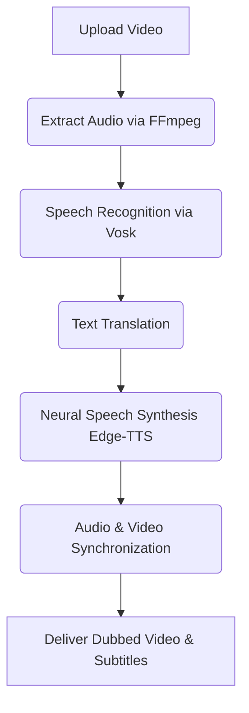

<div align="center">
  
# 🎬🌍 Seamless AI Video Translator & Dubber


[](https://www.python.org/)
[](https://flask.palletsprojects.com/)
[](https://ffmpeg.org/)
[](https://opensource.org/licenses/MIT)

*An intelligent, multi-threaded web application that instantly translates, syncs, and dubs video and audio content into multiple languages with precision.*

</div>

<br/>

## 📖 Table of Contents
- [About the Project](#-about-the-project)
- [Key Features](#-key-features)
- [Tech Stack](#-tech-stack)
- [Workflow Pipeline](#-architecture--workflow-pipeline)
- [Getting Started](#-getting-started)

---

## 🚀 About the Project

This AI-powered Flask web application automatically translates and dubs videos. It seamlessly extracts audio, utilizes **Vosk** offline machine learning for precise speech-to-text, translates the text, and synthesizes human-like voiceovers using **Edge Neural TTS**. **FFmpeg** then dynamically synchronizes the audio speed to the video length and auto-generates localized word-level subtitles.

---

## ✨ Key Features

| Feature | Description |
| :--- | :--- |
| 🔐 **Secure Authentication** | Complete signup, login, and secure sessions via Database Mapping. |
| 🎙️ **Precise Speech Recognition** | Employs the highly accurate, offline `Vosk` ML model to transcribe audio with word-level timestamps. |
| 🌐 **Global Translation** | Powered by `deep-translator` to translate transcribed text to target languages instantly. |
| 🗣️ **Human-like Neural Dubbing** | Utilizes Microsoft Edge Neural TTS (`edge-tts`) to generate natural voiceovers in various languages. |
| ⏱️ **Auto-Time Synchronization** | Dynamically adjusts the video time scale to seamlessly match the new spoken translation track using `ffmpeg`. |
| 📝 **Automated Subtitles** | Accurately maps the translated audio timing to auto-generate `.vtt` format subtitles. |
| 📊 **Interactive Dashboard** | Track real-time progress percentages of asynchronous background video rendering and manage historical projects. |

---

## 🛠️ Tech Stack

<div align="center">
  
</div>

- **Backend:** Python, Flask, Flask-SQLAlchemy
- **Media Engine:** FFmpeg (extraction, filtering, scaling, muxing)
- **AI / ML:** Vosk Offline Speech Recognition model
- **Speech Synthesis:** Edge-TTS (Neural Voice generation)
- **Database:** SQLite (Lightweight, robust mapping)

---

## 🏗️ Architecture & Workflow Pipeline



---

## 💻 Getting Started

Follow these instructions to get a copy of the project up and running on your local machine.

### Prerequisites

- **Python 3.8+**
- **[FFmpeg](https://ffmpeg.org/download.html)**: Required for all processing & rendering. You must install this system-wide and add it to your System PATH variables.
- **[Vosk Speech Model](https://alphacephei.com/vosk/models)**: Download a compatible language model (e.g., `vosk-model-en-us-0.22`), extract it into your project root, and explicitly rename the folder to `VoskModel`.

### Installation

**1. Clone the repository**
```bash
git clone https://github.com/Surekha2106/New_Audio_video.git
cd New_Audio_video
```

**2. Create a Python Virtual Environment**
```bash
python -m venv venv

# Activate on Windows:
venv\Scripts\activate

# Activate on macOS/Linux:
source venv/bin/activate
```

**3. Install Dependencies**
```bash
pip install -r requirements.txt
```

**4. Launch the Application**
```bash
python project1.py
```

> 🎉 **Success!** The application will be running locally at:
> **[http://localhost:5000](http://localhost:5000)**

---

<div align="center">

*Designed & developed by **Surekha*** ❤️

</div>
